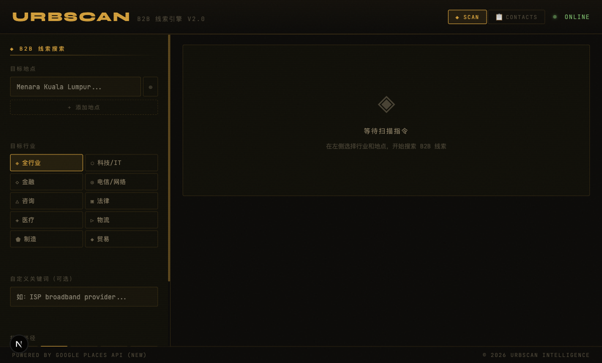
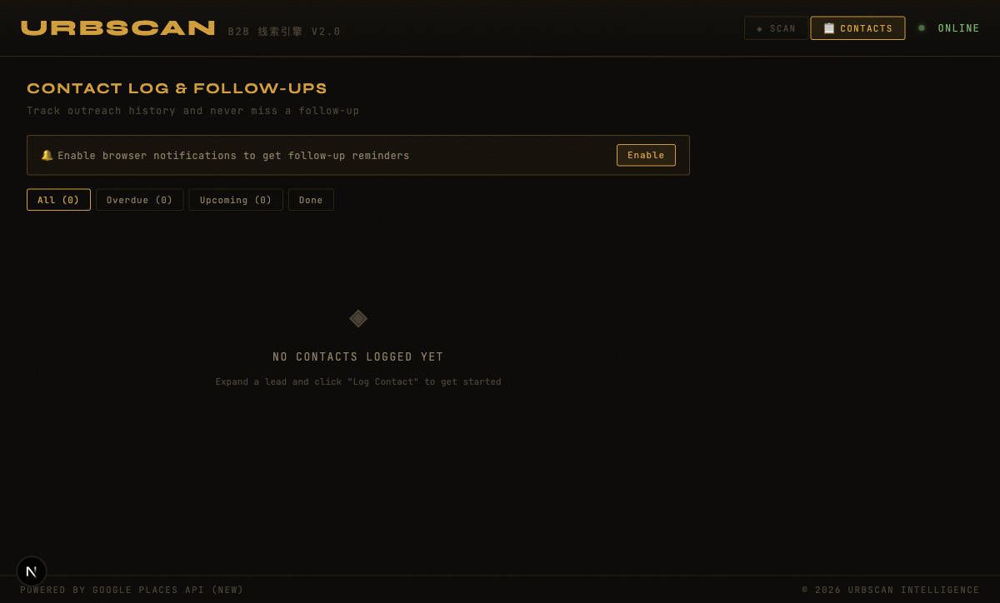

# URBSCAN — B2B Lead Intelligence Engine

> Find, score, and track B2B leads near any location in Malaysia using Google Places + Hunter.io + Apollo.io.



---

## What It Does

URBSCAN is a B2B prospecting tool built for field sales teams in Malaysia. Enter any address, pick an industry vertical, and it returns a scored list of nearby companies — complete with phone numbers, websites, email contacts, and LinkedIn links.

**Core workflow:**
1. Enter a location (or multiple locations)
2. Select an industry vertical
3. Get a ranked list of nearby B2B leads
4. Log outreach, set follow-up reminders, export to CSV

---

## Features

### Lead Discovery
- **Google Places API (New)** — parallel keyword search across 10 industry verticals
- **Lead scoring** — ranked by activity (review count), rating, and proximity
- **Adjustable score weights** — drag sliders to reprioritise by what matters to you
- **Multi-location search** — scan up to 5 locations simultaneously
- **Pagination** — up to 100 results per keyword, no artificial limits

### Industry Verticals
`All` `Tech/IT` `Finance` `Telco` `Consulting` `Legal` `Healthcare` `Logistics` `Manufacturing` `Trading`

### Contact Enrichment
- **Phone + website** from Google Places
- **Hunter.io** — email contacts with names, job titles, and confidence scores
- **Apollo.io** — company size, industry, LinkedIn, annual revenue, founding year
- **Bulk contact lookup** — one click finds contacts for all leads with websites

### Outreach Tools
- **WhatsApp Composer** — 4 English templates (fully editable), attach files/photos, one-click send
- **WhatsApp direct link** — `wa.me` deep link from any phone number
- **LinkedIn company search** — pre-built search URL per lead
- **Google Maps link** — open directions instantly

### Pipeline & CRM
- **5-stage pipeline** — New → Contacted → Following Up → Won → Lost
- **Notes per lead** — saved to localStorage automatically
- **Contact log** — record every outreach with method, notes, and timestamp
- **Follow-up reminders** — set a date, get a browser notification when due

### Contacts & Follow-ups Tab



- View all logged contacts in one place
- Filter: **All / Overdue / Upcoming / Done**
- Red badge on tab when follow-ups are overdue
- **📅 Add to Google Calendar** — one click creates a pre-filled calendar event (no OAuth required)
- Mark follow-ups done or reopen them

### Export
- **CSV export** — includes score, rating, phone, website, pipeline status, notes, and Hunter.io contacts (one row per contact person)

---

## Tech Stack

| Layer | Technology |
|-------|-----------|
| Framework | Next.js 16 (App Router) |
| Language | TypeScript |
| Maps | `@react-google-maps/api` |
| Fonts | Syne + JetBrains Mono |
| Lead Discovery | Google Places API (New) — Text Search |
| Email Enrichment | Hunter.io Domain Search API |
| Company Enrichment | Apollo.io Organization Enrich API |
| Storage | localStorage (pipeline, notes, contact log, history) |

---

## Setup

### 1. Clone & install

```bash
git clone https://github.com/darksm10-dotcom/urbscan.git
cd urbscan
npm install
```

### 2. Configure environment variables

Create `.env.local` in the project root:

```env
NEXT_PUBLIC_GOOGLE_MAPS_API_KEY=your_google_maps_key
HUNTER_API_KEY=your_hunter_io_key
APOLLO_API_KEY=your_apollo_io_key   # optional
```

| Key | Where to get | Free tier |
|-----|-------------|-----------|
| `NEXT_PUBLIC_GOOGLE_MAPS_API_KEY` | [Google Cloud Console](https://console.cloud.google.com) — enable **Places API (New)**, **Maps JavaScript API**, **Geocoding API** | $200/month credit |
| `HUNTER_API_KEY` | [hunter.io](https://hunter.io) | 25 searches/month |
| `APOLLO_API_KEY` | [apollo.io](https://app.apollo.io) | 50 credits/month |

### 3. Run

```bash
npm run dev
```

Open [http://localhost:3000](http://localhost:3000)

---

## How the Lead Score Works

Each lead is scored 0–100 across three dimensions:

| Dimension | Max | Formula |
|-----------|-----|---------|
| Activity (review count) | 40 pts | `min(40, reviewCount / 200 × 40)` |
| Google Rating | 40 pts | `(rating − 1) / 4 × 40` |
| Proximity | 20 pts | `(1 − distance / radius) × 20` |

Use the **Weight** sliders in the toolbar to redistribute these points in real time.

| Score | Label |
|-------|-------|
| ≥ 70 | HIGH |
| 40–69 | MED |
| < 40 | LOW |

---

## Project Structure

```
app/
├── api/
│   ├── nearby/       # Google Places proxy
│   ├── hunter/       # Hunter.io proxy
│   └── enrich/       # Apollo.io proxy
├── page.tsx           # Main page (Scan + Contacts tabs)
components/
├── SearchPanel.tsx    # Left sidebar — search controls
├── ResultsList.tsx    # Right panel — leads, composer, pipeline
├── BuildingMap.tsx    # Google Maps with custom markers
└── ContactsPanel.tsx  # Follow-up tracker
lib/
├── places.ts          # Geocoding + search with cache
├── cache.ts           # sessionStorage cache (10 min TTL)
├── pipeline.ts        # Lead status (localStorage)
├── contacts.ts        # Contact log + Google Calendar links
├── route.ts           # Nearest-neighbour route optimisation
└── history.ts         # Search history
types/
└── index.ts           # Shared TypeScript types
```

---

## License

MIT
